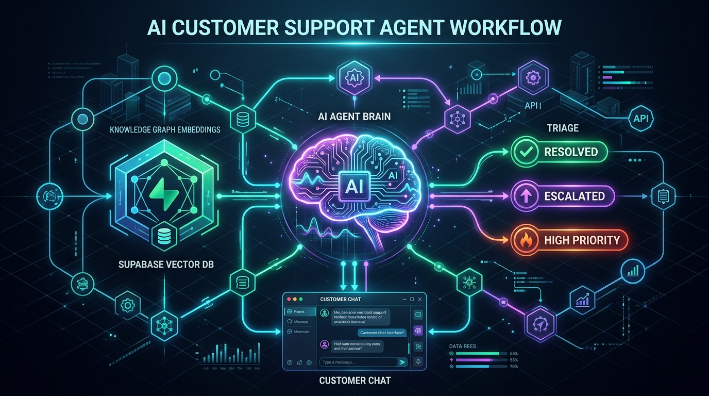
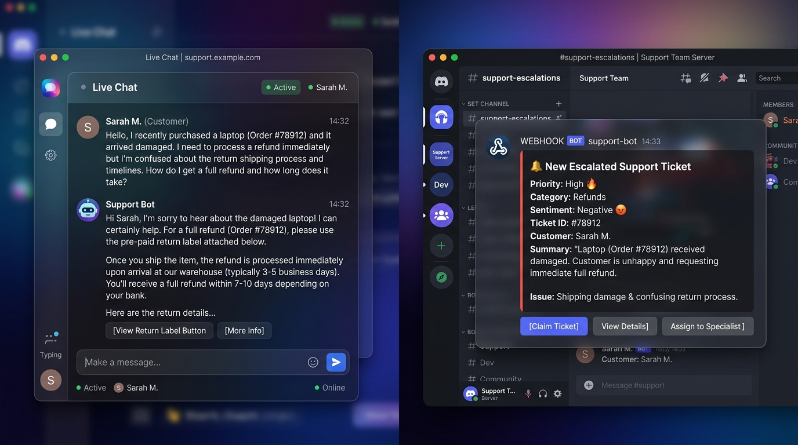

# 🤖 Autonomous AI Customer Support Agent with RAG & Multi-Channel Escalation

[](https://n8n.io/)
[](https://openai.com/)
[](https://supabase.com/)
[](https://discord.com/)
[](#)
[](LICENSE)

An enterprise-grade, autonomous customer support workflow engineered in **n8n**. Powered by **OpenAI GPT-5 mini** and **LangChain**, this agent handles tier-1 customer inquiries 24/7 with zero hallucinations by strictly grounding answers in official company policies using **Supabase pgvector (RAG)**. 

Every conversation is triaged in real time into structured metadata (category, priority, sentiment), logged into an internal audit table, and seamlessly escalated to human agents via **Discord Webhooks** whenever disputes or negative sentiments arise.

---

<p align="center">
  
</p>

---

## 📑 Table of Contents

- [Executive Summary](#-executive-summary)
- [System Architecture](#-system-architecture)
  - [1. Knowledge Base Ingestion Pipeline](#1-knowledge-base-ingestion-pipeline)
  - [2. Live Support & Multi-Turn Reasoning Agent](#2-live-support--multi-turn-reasoning-agent)
- [Key Engineering Highlights](#-key-engineering-highlights)
- [End-to-End User Experience Preview](#-end-to-end-user-experience-preview)
- [Detailed Workflow Breakdown](#-detailed-workflow-breakdown)
  - [Ingestion Branch](#ingestion-branch)
  - [Live Agent Branch](#live-agent-branch)
- [Structured Triage & Log Schema](#-structured-triage--log-schema)
- [Database Setup (Supabase pgvector)](#-database-setup-supabase-pgvector)
- [Setup & Deployment Guide](#-setup--deployment-guide)
  - [Prerequisites](#prerequisites)
  - [Importing into n8n](#importing-into-n8n)
  - [Configuring Credentials](#configuring-credentials)
  - [Executing Seed Ingestion](#executing-seed-ingestion)
- [Validation & Test Scenarios](#-validation--test-scenarios)
- [Production Best Practices & Extensibility](#-production-best-practices--extensibility)
- [Author & Credits](#-author--credits)

---

## 📌 Executive Summary

Traditional customer support bots frequently fail due to two extremes: rigid rule-based bots that frustrate users with repetitive menus, or unconstrained LLMs that hallucinate return policies and make unauthorized commitments.

This workflow provides a production-tested middle ground:
1. **Strict Grounding (RAG)**: The agent has mandatory tool-calling instructions. It searches the **Supabase Vector Store** using high-dimensional cosine similarity embeddings before answering any policy question.
2. **Context-Aware Dialogue**: Maintains a rolling buffer window memory (last 10 conversation turns) for natural, coherent multi-turn interactions.
3. **Autonomous Triage**: Generates a typed JSON payload classifying ticket urgency, sentiment, and category on every single turn.
4. **Smart Escalation (Human-in-the-Loop)**: Identifies angry customers, refund disputes, or unresolvable inquiries instantly, notifying human staff on Discord with contextual ticket summaries while maintaining a cordial user dialog.

---

## 🏗️ System Architecture

The workflow is architected into two distinct operational flows within a single unified n8n configuration:

```mermaid
flowchart TD
    subgraph Ingestion_Pipeline["1. Knowledge Base Ingestion Pipeline (Run on Update)"]
        A1["Manual Trigger<br><b>Load Knowledge Base</b>"] --> A2["Set Node<br><b>Company FAQ & Policies</b>"]
        A2 --> A3["Document Loader<br><b>Split & Load FAQ</b>"]
        A4["Recursive Character<br><b>Text Splitter (800 / 100)</b>"] -.-> A3
        A5["OpenAI Embeddings<br><b>text-embedding-3-small</b>"] -.-> A6["Supabase Vector Store<br><b>Store Docs in Supabase</b>"]
        A3 --> A6
    end

    subgraph Runtime_Pipeline["2. Autonomous Live Support & Escalation Engine"]
        B1["Customer Chat Widget<br><b>Chat Trigger (Session ID)</b>"] --> B2["LangChain Agent<br><b>AI Support Agent</b>"]
        
        B3["OpenAI Chat Model<br><b>GPT-5 mini</b>"] -.-> B2
        B4["Window Buffer Memory<br><b>Conversation Memory (k=10)</b>"] -.-> B2
        B5["Vector Store Tool<br><b>Company Knowledge Base</b>"] -.-> B2
        B6["OpenAI Embeddings<br><b>Search Embeddings</b>"] -.-> B5
        B7["Output Parser<br><b>Structured JSON Output</b>"] -.-> B2
        
        B2 --> B8["Data Table Node<br><b>Save Ticket to Log</b>"]
        B8 --> B9{"IF Condition<br><b>Needs Human Handoff?</b>"}
        
        B9 -- "True (Escalated)" --> B10["Discord Webhook<br><b>Escalate to Team Channel</b>"]
        B10 --> B11["Set Node<br><b>Format Chat Reply</b>"]
        
        B9 -- "False (Resolved)" --> B11
        B11 --> B12["Return Formatted Response<br><b>Customer Live Chat Window</b>"]
    end

    style Ingestion_Pipeline fill:#0f172a,stroke:#38bdf8,stroke-width:2px,color:#fff
    style Runtime_Pipeline fill:#090d16,stroke:#818cf8,stroke-width:2px,color:#fff
    style B2 fill:#312e81,stroke:#a5b4fc,stroke-width:2px,color:#fff
    style B10 fill:#4338ca,stroke:#f43f5e,stroke-width:2px,color:#fff
    style A6 fill:#064e3b,stroke:#34d399,stroke-width:2px,color:#fff
```



### 1. Knowledge Base Ingestion Pipeline
- **Input**: Raw markdown, text documents, or policies.
- **Chunking**: Recursive character splitting with `chunkSize: 800` and `chunkOverlap: 100` to preserve semantic continuity across boundaries.
- **Embedding**: OpenAI `text-embedding-3-small` vectorizer (1536 dimensions).
- **Storage**: Supabase PostgreSQL with `pgvector`, indexed via HNSW cosine distance for sub-millisecond retrieval.

### 2. Live Support & Multi-Turn Reasoning Agent
- **Trigger**: Embedded chat widget passing user query and ephemeral or authenticated `sessionId`.
- **Reasoning**: LangChain Agent coordinating between short-term memory, vector retrieval tool, and structured output parsing.
- **Audit Logging**: Persisting session metrics, sentiment rating, category, priority, and generated answers.
- **Escalation**: Asynchronous notification dispatch to team Discord channels.

---

## ✨ Key Engineering Highlights

| Feature | Technical Implementation | Value Delivered |
|---|---|---|
| **Zero-Hallucination RAG** | LangChain Vector Store Tool hooked to Supabase `match_documents()` | Forces LLM to ground answers exclusively in vetted company policies. |
| **Multi-Turn Context** | `@n8n/n8n-nodes-langchain.memoryBufferWindow` (10 turns) | Customers never have to repeat themselves; handles follow-up questions gracefully. |
| **Guaranteed Structured Output** | LangChain Structured Output Parser enforcing strict JSON schema | Guarantees machine-readable attributes for programmatic downstream routing. |
| **Automated Triage** | Real-time sentiment analysis, category tagging, and urgency scoring | Eliminates manual ticket sorting; prioritizes high-impact complaints instantly. |
| **Proactive Human Handoff** | Conditional IF evaluation dispatching rich Discord webhook embeds | Ensures high-risk or dissatisfied customers reach human specialists immediately. |
| **Audit Compliance** | Internal n8n Data Table tracking status (`resolved` vs `escalated`) | Provides managers with full visibility into automation resolution rates and logs. |

---

## 🖼️ End-to-End User Experience Preview

<p align="center">
  
</p>

*Left: Customer receiving an immediate, policy-backed resolution in the web chat. Right: Team alert triggered in Discord with actionable priority metrics and issue summary.*

---

## 🔍 Detailed Workflow Breakdown

### Ingestion Branch

```
[Load Knowledge Base] ──► [Company FAQ & Policies] ──► [Store Docs in Supabase]
                                                              ▲          ▲
                                                              │          │
                                                    [Ingest Embeddings]  [Split & Load FAQ]
                                                                                ▲
                                                                                │
                                                                          [Chunk Text]
```

1. **`Load Knowledge Base`** (`n8n-nodes-base.manualTrigger`): Manual trigger allowing one-click re-indexing when policies update.
2. **`Company FAQ & Policies`** (`n8n-nodes-base.set`): Holds source documentation covering Shipping, Refunds & Returns, Order Changes, Account Security, Payments, and Warranty Terms.
3. **`Chunk Text`** (`textSplitterRecursiveCharacterTextSplitter`): 
   - Chunk Size: `800` characters
   - Chunk Overlap: `100` characters
4. **`Ingest Embeddings`** (`embeddingsOpenAi`): Converts text blocks into 1536-dimensional vectors.
5. **`Store Docs in Supabase`** (`vectorStoreSupabase`): Performs batch upsert into the `documents` table in PostgreSQL.

---

### Live Agent Branch

```
[Customer Chat] ──► [AI Support Agent] ──► [Save Ticket to Log] ──► [Needs Human Handoff?]
                           │                                                 │
            ┌──────────────┼──────────────┐                                  ├──► [Escalate to Discord] ──┐
            ▼              ▼              ▼                                  │                            │
       [GPT-5 mini]   [Memory]     [Vector Tool]                             └──► [Format Chat Reply] ◄───┘
                                          ▲                                                 │
                                          │                                                 ▼
                                     [Embeddings]                                   (Customer Output)
```

1. **`Customer Chat`** (`chatTrigger`): Public webhook endpoint rendering the interactive chat widget with custom placeholder, title, and session tracking.
2. **`AI Support Agent`** (`@n8n/n8n-nodes-langchain.agent` v3.1):
   - **System Instruction**: Enforces strict adherence to knowledge base retrieval before replying.
   - **Model**: `gpt-5-mini` via OpenAI API.
   - **Memory**: Context window buffer of 10 interactions.
   - **Tool**: `Company Knowledge Base` vector tool.
   - **Output Parsing**: Forces response into structured JSON.
3. **`Save Ticket to Log`** (`n8n-nodes-base.dataTable`): Writes ticket record to table `Support Tickets`.
4. **`Needs Human Handoff?`** (`n8n-nodes-base.if`): Evaluates `output.needs_human === true`.
5. **`Escalate to Discord`** (`n8n-nodes-base.discord`): Dispatches priority banner to customer support channel with customer quote and triage summary.
6. **`Format Chat Reply`** (`n8n-nodes-base.set`): Sanitizes `output.answer` to return clean text to the end user.

---

## 📊 Structured Triage & Log Schema

Every customer turn generates a strict JSON payload validated by the output parser:

```json
{
  "answer": "Our standard shipping takes 3–5 business days within the US and is free on orders over $50.",
  "category": "shipping",
  "priority": "low",
  "sentiment": "neutral",
  "needs_human": false,
  "ticket_summary": "Customer inquired about standard domestic shipping transit times and rates."
}
```

### Ticket Log Fields (`Support Tickets` Data Table)

| Field Name | Type | Description | Expression |
|---|---|---|---|
| `session_id` | String | Unique conversation session identifier | `={{ $('Customer Chat').item.json.sessionId }}` |
| `customer_message` | String | Raw customer query | `={{ $('Customer Chat').item.json.chatInput }}` |
| `agent_answer` | String | Formatted response generated by AI | `={{ $('AI Support Agent').item.json.output.answer }}` |
| `category` | Enum | `shipping`, `refunds`, `orders`, `account`, `payments`, `warranty`, `other` | `={{ $('AI Support Agent').item.json.output.category }}` |
| `priority` | Enum | `low`, `medium`, `high` | `={{ $('AI Support Agent').item.json.output.priority }}` |
| `sentiment` | Enum | `positive`, `neutral`, `negative` | `={{ $('AI Support Agent').item.json.output.sentiment }}` |
| `status` | String | `resolved` or `escalated` | `={{ $('AI Support Agent').item.json.output.needs_human ? 'escalated' : 'resolved' }}` |
| `summary` | String | High-level 1-line recap for audit logs | `={{ $('AI Support Agent').item.json.output.ticket_summary }}` |

---

## 🗄️ Database Setup (Supabase pgvector)

Run the following SQL script in your **Supabase SQL Editor** (available in [`sql/supabase_schema.sql`](./sql/supabase_schema.sql)):

```sql
-- 1. Enable the vector extension
CREATE EXTENSION IF NOT EXISTS vector;

-- 2. Create documents table for knowledge embeddings
CREATE TABLE IF NOT EXISTS public.documents (
  id BIGSERIAL PRIMARY KEY,
  content TEXT NOT NULL,
  metadata JSONB DEFAULT '{}'::jsonb,
  embedding VECTOR(1536) -- Matches text-embedding-3-small dimensions
);

-- 3. Create high-speed HNSW index for cosine distance
CREATE INDEX IF NOT EXISTS documents_embedding_hnsw_idx 
ON public.documents 
USING hnsw (embedding vector_cosine_ops);

-- 4. Create document matching function for n8n LangChain
CREATE OR REPLACE FUNCTION public.match_documents (
  query_embedding VECTOR(1536),
  match_count INT DEFAULT 5,
  filter JSONB DEFAULT '{}'::jsonb
) 
RETURNS TABLE (
  id BIGINT,
  content TEXT,
  metadata JSONB,
  similarity FLOAT
)
LANGUAGE plpgsql
AS $$
#variable_conflict use_column
BEGIN
  RETURN QUERY
  SELECT
    documents.id,
    documents.content,
    documents.metadata,
    1 - (documents.embedding <=> query_embedding) AS similarity
  FROM public.documents
  WHERE documents.metadata @> filter
  ORDER BY documents.embedding <=> query_embedding
  LIMIT match_count;
END;
$$;
```

---

## 🚀 Setup & Deployment Guide

### Prerequisites

- An active **n8n** instance (Cloud or self-hosted v1.0+)
- **OpenAI API Key** (with access to `gpt-5-mini` / `gpt-4o-mini` and `text-embedding-3-small`)
- **Supabase Account** with a new or existing project
- **Discord Server** with a Webhook URL configured in a `#support-escalations` channel

### Importing into n8n

1. Clone or download this repository:
   ```bash
   git clone https://github.com/Harmain89/AI-Customer-Support.git
   cd AI-Customer-Support
   ```
2. Open your n8n workspace.
3. Click **Workflows** → **Import from File...** and select [`main-workflow.json`](./main-workflow.json).

### Configuring Credentials

Within your n8n canvas, configure the corresponding credentials for the nodes:
1. **OpenAI**: Add your OpenAI API Key and bind it to:
   - `GPT-5 mini`
   - `Ingest Embeddings`
   - `Search Embeddings`
2. **Supabase**: Add your Supabase Host URL and Service Role Key to:
   - `Store Docs in Supabase`
   - `Company Knowledge Base`
3. **Discord**: Add your Discord Webhook URL to:
   - `Escalate to Discord`
4. **Data Table**: Ensure an n8n Data Table named `Support Tickets` is created with the schema outlined above, or update the node to point to your table ID.

### Executing Seed Ingestion

1. Click on the **`Load Knowledge Base`** node.
2. Click **Test Step** or **Execute Workflow**.
3. Verify in your Supabase dashboard that chunks are populated in the `documents` table with valid non-null embeddings.

---

## 🧪 Validation & Test Scenarios

| Scenario | Input Message | Expected Action | Expected Output Category / Status |
|---|---|---|---|
| **Standard Policy** | *"How long does standard shipping take?"* | Agent searches vector DB, retrieves 3-5 days policy, answers customer directly. | Category: `shipping`<br>Priority: `low`<br>Status: `resolved` |
| **Return Inquiry** | *"Can I return a final sale item?"* | Agent retrieves policy noting Final Sale items cannot be returned, politely explains. | Category: `refunds`<br>Priority: `low`<br>Status: `resolved` |
| **Angry Customer** | *"My order arrived broken and this is unacceptable! I want an immediate refund!"* | Detects negative sentiment, reassures customer, immediately alerts Discord channel. | Category: `refunds`<br>Priority: `high`<br>Status: `escalated` |
| **Out-of-Scope Query** | *"Do you have a physical store in Chicago for pickup?"* | Acknowledges absence of info in knowledge base, informs customer an agent will follow up. | Category: `other`<br>Priority: `medium`<br>Status: `escalated` |
| **Human Handoff** | *"I want to speak with a human support agent now."* | Flags explicit handoff intent, dispatches urgent notification to team. | Category: `other`<br>Priority: `medium`<br>Status: `escalated` |

---

## 💡 Production Best Practices & Extensibility

- **CRM / Helpdesk Sync**: Replace or augment the Discord escalation node with nodes for **Zendesk**, **Freshdesk**, **HubSpot**, or **Salesforce** to automatically create support tickets.
- **Dynamic Order Verification**: Add an n8n HTTP Request Tool allowing the agent to query a Shopify / WooCommerce / custom API with the customer's order ID and email to fetch live shipment tracking numbers.
- **Multi-Lingual Auto-Detection**: Supply multilingual embedding models (such as Cohere or OpenAI v3) to allow foreign language customer inquiries to query English documentation seamlessly.
- **Sentiment Thresholding**: Adjust escalation sensitivity by refining system prompt criteria or adding numeric sentiment classifiers.

---

## 👨‍💻 Author & Credits

Engineered with precision by **Harmain Rizwan** — *AI Agents & Workflow Automation Architect*.

<!-- - 🌐 **Portfolio**: [harmainrizwan.com](https://harmainrizwan.com) -->
- 💼 **LinkedIn**: [linkedin.com/in/harmain-rizwan](https://linkedin.com/in/harmain-rizwan)
- 🐙 **GitHub**: [@Harmain89](https://github.com/Harmain89)
- 📩 **Contact**: [Get in touch](mailto:harmainrizwanr@gmail.com)

---

<p align="center">
  <sub>Built for production resilience and high-conversion customer satisfaction using open orchestration standards.</sub>
</p>
