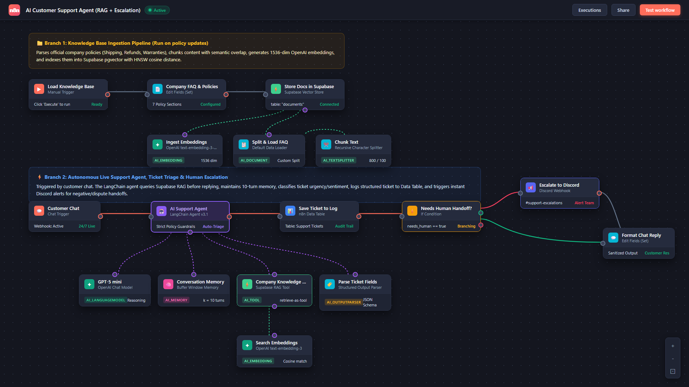

# Autonomous AI Customer Support Agent (n8n + RAG)

[](https://n8n.io/)
[](https://openai.com/)
[](https://supabase.com/)
[](https://discord.com/)
[](LICENSE)

An enterprise-ready **n8n** automation workflow that delivers 24/7 customer support with **zero hallucinations**. Grounded strictly in company documentation using **Supabase pgvector (RAG)**, it maintains multi-turn context, classifies every ticket (category, priority, sentiment), logs structured audit trails, and instantly escalates angry or disputed cases to **Discord**.

---

## 🗺️ Workflow Architecture

<p align="center">
  
</p>

The workflow is architected into two operational branches inside [`main-workflow.json`](./main-workflow.json):

| Branch | Trigger | Purpose |
|---|---|---|
| **1. Knowledge Ingestion** | Manual Trigger | Chunks company policies (800 chars / 100 overlap), embeds with OpenAI (`text-embedding-3-small`), and indexes vectors in Supabase with HNSW cosine similarity. |
| **2. Live Support & Escalation** | Chat Trigger | LangChain agent queries Supabase RAG before answering, retains 10-turn conversation memory, logs ticket to Data Table, and routes escalations via IF condition. |

---

## ⚡ Live User Experience & Escalation

<p align="center">
  
</p>

| Customer Experience (Left) | Support Team Channel (Right) |
|---|---|
| • Clean web chat widget with session persistence.<br>• Instant, empathetic, policy-backed replies.<br>• Never invents return rules or shipping guarantees.<br>• Reassures customer when human handoff is required. | • Instant webhook alert in Discord `#support-escalations`.<br>• Real-time urgency metrics (**Priority: High**, **Category**, **Sentiment**).<br>• Includes customer query and a 1-line AI summary.<br>• Enables rapid team intervention before customer churn. |

---

## 🎯 Why This Architecture?

| Feature | Generic Chatbots | Unconstrained LLMs | **This n8n System** |
|---|---|---|---|
| **Policy Accuracy** | ❌ Rigid script trees | ⚠️ Frequent hallucinations | ✅ **Strict RAG tool grounding** |
| **Context Retention** | ❌ Single-turn only | ⚠️ Unbounded token costs | ✅ **10-turn rolling buffer window** |
| **Triage & Classification** | ❌ Manual support sorting | ❌ Raw unparsed text | ✅ **Typed JSON metadata per turn** |
| **Human Handoff** | ❌ Customer gets stuck | ❌ Silent failure | ✅ **Automated Discord alert webhook** |
| **Audit Logging** | ⚠️ Fragmented logs | ❌ No native logging | ✅ **Structured n8n Data Table audit log** |

---

## 🔧 Node-by-Node Technical Reference

### Branch 1: Knowledge Base Ingestion

| Node | Type | Configuration / Role |
|---|---|---|
| `Load Knowledge Base` | `manualTrigger` | One-click trigger to index or update documentation. |
| `Company FAQ & Policies` | `set` | Holds authoritative policies (Shipping, Refunds, Cancellations, Accounts, Payments, Warranty). |
| `Store Docs in Supabase` | `vectorStoreSupabase` | Target table: `documents`. Mode: `insert`. |
| `Ingest Embeddings` | `embeddingsOpenAi` | Model: `text-embedding-3-small` (1536 dimensions). |
| `Split & Load FAQ` | `documentDefaultDataLoader` | Connects raw text into text chunker. |
| `Chunk Text` | `textSplitterRecursiveCharacterTextSplitter` | `chunkSize: 800`, `chunkOverlap: 100`. |

### Branch 2: Live Support Agent & Triage

| Node | Type | Configuration / Role |
|---|---|---|
| `Customer Chat` | `chatTrigger` | Public chat endpoint, persistent memory by `sessionId`. |
| `AI Support Agent` | `agent (LangChain v3.1)` | Coordinates tools, memory, prompt guardrails, and output parser. |
| `GPT-5 mini` | `lmChatOpenAi` | Reasoning engine for triage and conversational responses. |
| `Conversation Memory` | `memoryBufferWindow` | Retains rolling `contextWindowLength: 10`. |
| `Company Knowledge Base` | `vectorStoreSupabase` | Mode: `retrieve-as-tool`. Enforces RAG search before replying. |
| `Search Embeddings` | `embeddingsOpenAi` | Generates query vector for Supabase similarity search. |
| `Parse Ticket Fields` | `outputParserStructured` | Validates strict JSON output schema. |
| `Save Ticket to Log` | `dataTable` | Writes record to internal `Support Tickets` table. |
| `Needs Human Handoff?` | `if` | Evaluates boolean expression: `{{ $json.output.needs_human }} === true`. |
| `Escalate to Discord` | `discord` | Dispatches formatted rich markdown alert via webhook. |
| `Format Chat Reply` | `set` | Extracts `output.answer` to return clean response to customer. |

---

## 📊 Structured Triage & Log Schema

Every interaction produces a validated JSON payload:

```json
{
  "answer": "Standard shipping takes 3-5 business days within the US ($4.99, or free over $50).",
  "category": "shipping",
  "priority": "low",
  "sentiment": "neutral",
  "needs_human": false,
  "ticket_summary": "Customer asked about standard shipping rates and delivery times."
}
```

### Audit Log Mapping (`Support Tickets` Data Table)

| Column | Type | Expression | Description |
|---|---|---|---|
| `session_id` | String | `={{ $('Customer Chat').item.json.sessionId }}` | Chat session identifier |
| `customer_message` | String | `={{ $('Customer Chat').item.json.chatInput }}` | Raw user query |
| `agent_answer` | String | `={{ $('AI Support Agent').item.json.output.answer }}` | Answer delivered to user |
| `category` | Enum | `={{ $('AI Support Agent').item.json.output.category }}` | shipping, refunds, orders, account, payments, warranty, other |
| `priority` | Enum | `={{ $('AI Support Agent').item.json.output.priority }}` | low, medium, high |
| `sentiment` | Enum | `={{ $('AI Support Agent').item.json.output.sentiment }}` | positive, neutral, negative |
| `status` | String | `={{ $('AI Support Agent').item.json.output.needs_human ? 'escalated' : 'resolved' }}` | resolved vs escalated |
| `summary` | String | `={{ $('AI Support Agent').item.json.output.ticket_summary }}` | 1-line recap for audit |

---

## 🗄️ Database Setup (Supabase pgvector)

Run the SQL script from [`sql/supabase_schema.sql`](./sql/supabase_schema.sql) in your **Supabase SQL Editor**:

```sql
-- 1. Enable pgvector
CREATE EXTENSION IF NOT EXISTS vector;

-- 2. Knowledge Base Table
CREATE TABLE IF NOT EXISTS public.documents (
  id BIGSERIAL PRIMARY KEY,
  content TEXT NOT NULL,
  metadata JSONB DEFAULT '{}'::jsonb,
  embedding VECTOR(1536)
);

-- 3. HNSW Cosine Distance Index
CREATE INDEX IF NOT EXISTS documents_embedding_hnsw_idx 
ON public.documents 
USING hnsw (embedding vector_cosine_ops);

-- 4. LangChain Similarity Search Function
CREATE OR REPLACE FUNCTION public.match_documents (
  query_embedding VECTOR(1536),
  match_count INT DEFAULT 5,
  filter JSONB DEFAULT '{}'::jsonb
) 
RETURNS TABLE (
  id BIGINT,
  content TEXT,
  metadata JSONB,
  similarity FLOAT
)
LANGUAGE plpgsql
AS $$
#variable_conflict use_column
BEGIN
  RETURN QUERY
  SELECT
    documents.id,
    documents.content,
    documents.metadata,
    1 - (documents.embedding <=> query_embedding) AS similarity
  FROM public.documents
  WHERE documents.metadata @> filter
  ORDER BY documents.embedding <=> query_embedding
  LIMIT match_count;
END;
$$;
```

---

## 🚀 Quickstart Guide

### 1. Import Workflow
1. Open n8n $\rightarrow$ **Workflows** $\rightarrow$ **Import from File...**
2. Select [`main-workflow.json`](./main-workflow.json).

### 2. Connect Credentials
- **OpenAI**: Add API Key $\rightarrow$ Bind to `GPT-5 mini`, `Ingest Embeddings`, `Search Embeddings`.
- **Supabase**: Add URL & Service Key $\rightarrow$ Bind to `Store Docs in Supabase`, `Company Knowledge Base`.
- **Discord**: Add Webhook URL $\rightarrow$ Bind to `Escalate to Discord`.
- **Data Table**: Confirm `Support Tickets` table exists in your n8n workspace.

### 3. Ingest Documents
Click the **`Load Knowledge Base`** node $\rightarrow$ click **Execute step**. Chunks and embeddings are indexed in Supabase.

### 4. Activate & Test
Toggle the workflow to **Active**. Open the Chat Trigger URL to interact live with the agent.

---

## 🧪 Validation Scenarios

| Test Case | Sample Input | Expected Behavior | Category / Status |
|---|---|---|---|
| **Standard Policy** | *"How long does standard shipping take?"* | Queries Supabase RAG, returns 3-5 business days policy. | `shipping` / `resolved` |
| **Return Inquiry** | *"Can I return a Final Sale item?"* | Retrieves policy: Final Sale items cannot be returned. | `refunds` / `resolved` |
| **Angry Customer** | *"Package arrived broken! I demand an immediate refund!"* | Identifies negative sentiment, sends reassuring reply, alerts Discord. | `refunds` / `escalated` |
| **Out of Scope** | *"Do you have a physical store in Chicago?"* | Transparently states info is missing, routes to team on Discord. | `other` / `escalated` |
| **Human Request** | *"Let me talk to a human agent right now."* | Acknowledges request, notifies team via webhook. | `other` / `escalated` |

---

## 👨‍💻 Author & Credits

Engineered with precision by **Harmain Rizwan** — *AI Agents & Workflow Automation Architect*.

<!-- - 🌐 **Portfolio**: [harmainrizwan.com](https://harmainrizwan.com) -->
- 💼 **LinkedIn**: [linkedin.com/in/harmain-rizwan](https://linkedin.com/in/harmain-rizwan)
- 🐙 **GitHub**: [@Harmain89](https://github.com/Harmain89)
- 📩 **Contact**: [Get in touch](mailto:harmainrizwanr@gmail.com)
